# 证书管理系统用户手册

## 目录

- [一、系统简介](#一系统简介)
- [二、学生端操作指南](#二学生端操作指南)
- [三、教师端操作指南](#三教师端操作指南)
- [四、教学秘书端操作指南](#四教学秘书端操作指南)
- [五、管理端操作指南](#五管理端操作指南)
- [六、常见问题](#六常见问题)

---

## 一、系统简介

### 1.1 系统概述

证书管理系统是一个基于Web的证书管理平台，支持证书上传、AI智能识别、审核管理、数据统计等功能。系统采用角色权限管理，为不同用户提供相应的功能模块。

### 1.2 用户角色说明

系统包含四种用户角色：

- **学生 (student)**: 可以上传证书、查看自己的证书、编辑草稿状态的证书
- **教师 (teacher)**: 可以上传证书、查看和审核自己指导的学生证书、设置评分
- **教学秘书 (secretary)**: 可以查看本院证书数据、审核证书、查看统计报表
- **管理员 (admin)**: 拥有全部权限，包括用户管理、系统配置、数据统计等

### 1.3 证书状态说明

证书在系统中会经历以下状态：

- **草稿 (draft)**: 证书已创建但未提交，可以编辑
- **待教师审核 (pending_teacher)**: 学生提交后等待教师审核
- **待管理员审核 (pending_admin)**: 教师提交后等待管理员审核
- **已通过 (approved)**: 证书已审核通过

---

## 二、学生端操作指南

### 2.1 登录系统

1. 打开系统登录页面
2. 输入您的**学号**和**密码**
3. 点击"登录"按钮
4. 登录成功后，系统会自动跳转到仪表盘页面

**注意**: 如果您还没有账号，可以点击"注册"按钮进行注册，或联系管理员为您创建账号。

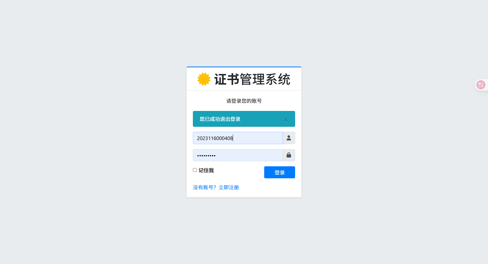

### 2.2 注册账号

1. 在登录页面点击"注册"按钮

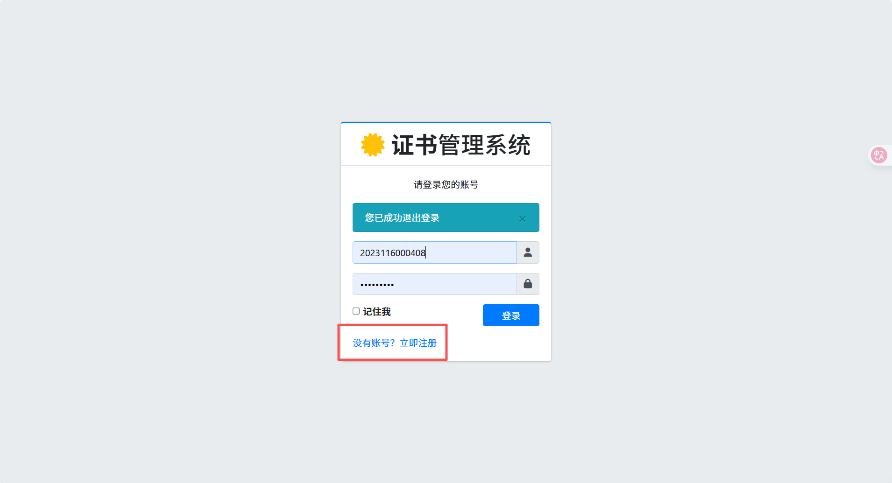

1. 填写以下信息：
   
   - **学号**: 您的学生学号
   - **姓名**: 您的真实姓名
   - **邮箱**: 您的邮箱地址（用于找回密码）
   - **学院**: 选择您所在的学院
   - **密码**: 设置登录密码
   - **确认密码**: 再次输入密码确认
   
   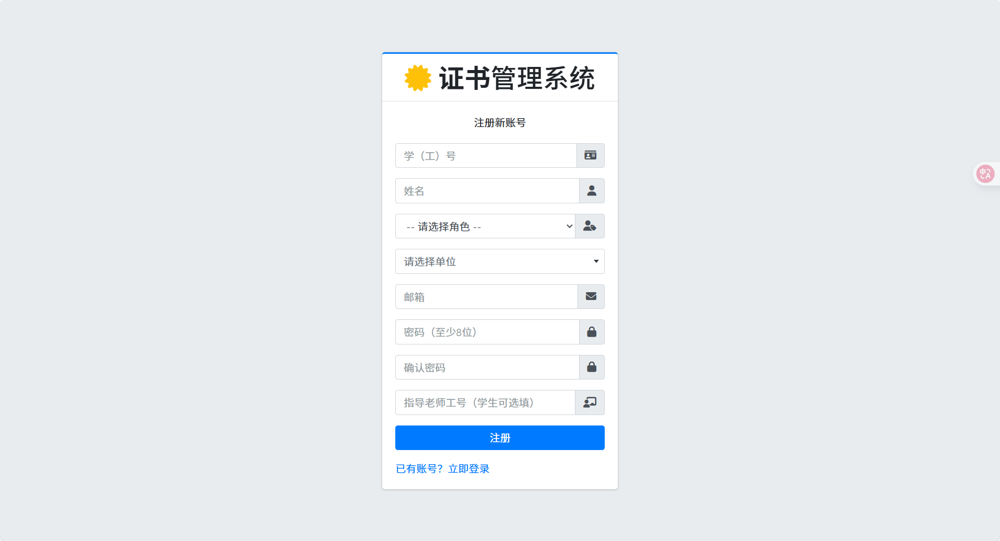

2. 点击"注册"按钮完成注册

3. 注册成功后，使用学号和密码登录系统

### 2.3 上传证书

#### 2.3.1 进入上传页面

1. 登录后，在左侧菜单栏找到"证书管理"分类
2. 点击"上传证书"菜单项

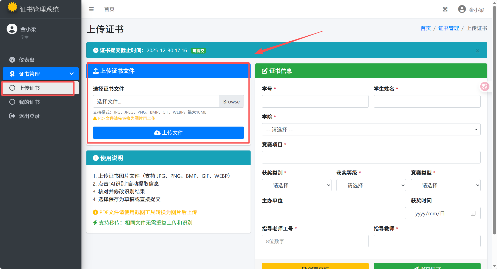

#### 2.3.2 上传证书文件

1. 在"上传证书文件"区域，点击"选择文件"按钮
2. 选择您要上传的证书图片文件（支持 JPG、PNG、BMP、GIF、WEBP 格式）
3. 点击"上传"按钮
4. 系统会自动计算文件MD5值，如果检测到相同证书，会提示"秒传成功"并自动加载之前的数据

**注意**: 

- 系统只支持图片格式，如果您的证书是PDF格式，请先转换为图片
- 文件大小建议不超过10MB
- 上传成功后，系统会显示文件预览

#### 2.3.3 AI智能识别

1. 文件上传成功后，点击"AI识别"按钮
2. 系统会自动调用AI识别服务，提取证书中的关键信息
3. 识别完成后，证书信息会自动填充到右侧的"证书信息"表单中
4. 请仔细核对识别结果，如有错误请手动修改

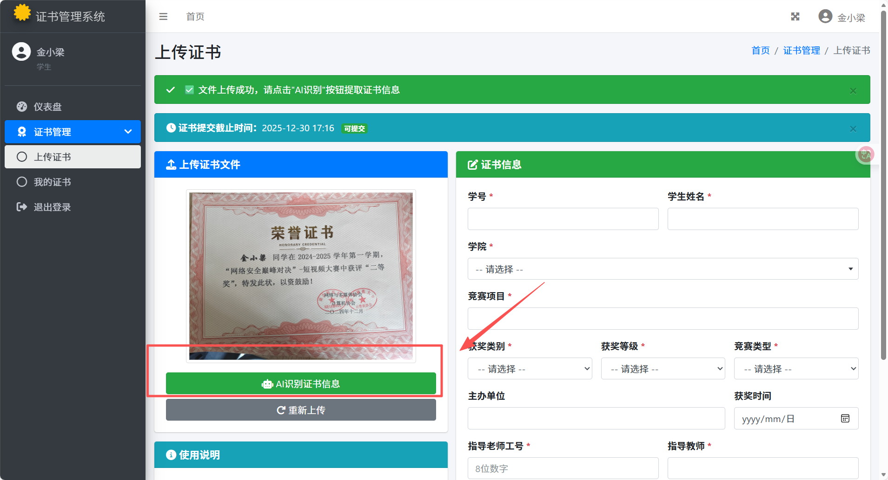

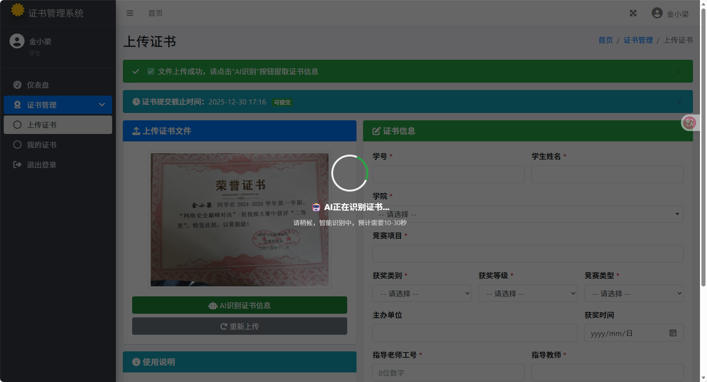

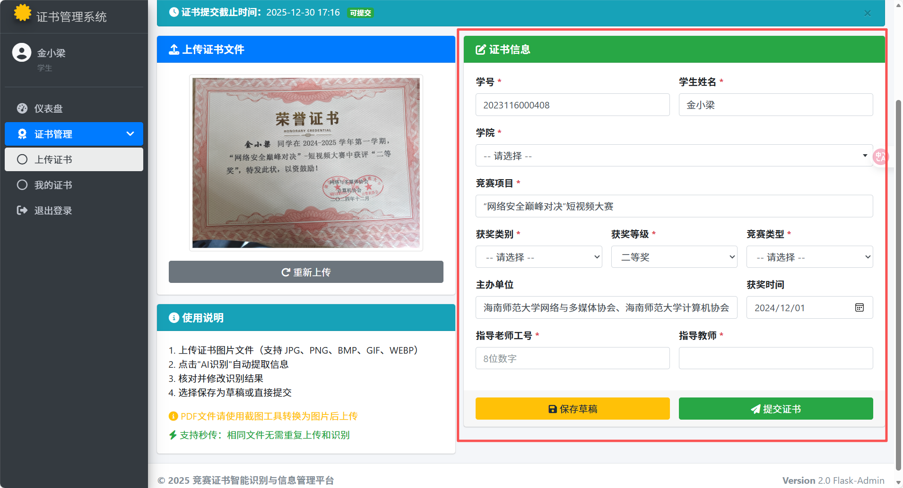

**注意**: 

- AI识别需要一定时间，请耐心等待
- 如果识别失败或识别结果不准确，您可以手动填写证书信息

#### 2.3.4 填写证书信息

在"证书信息"表单中，填写或核对以下信息：

- **学号**: 获奖学生的学号（系统会自动填充您的学号）
- **姓名**: 获奖学生的姓名（系统会自动填充您的姓名）
- **学院**: 选择学生所在的学院
- **竞赛项目**: 竞赛或比赛的全称
- **获奖类别**: 选择获奖类别（如：国家级、省级、市级等）
- **获奖等级**: 选择获奖等级（如：一等奖、二等奖、三等奖等）
- **竞赛类型**: 选择竞赛类型（如：A类、B类等）
- **主办单位**: 填写竞赛的主办单位
- **获奖时间**: 选择获奖日期
- **指导教师**: 填写指导教师的姓名
- **指导老师工号**: 填写指导教师的工号

**注意**: 所有带红色星号(*)的字段为必填项，必须填写完整才能保存。

#### 2.3.5 保存证书

证书信息填写完成后，您可以选择：

1.**保存为草稿**: 点击"保存草稿"按钮，证书将保存为草稿状态，您可以稍后继续编辑

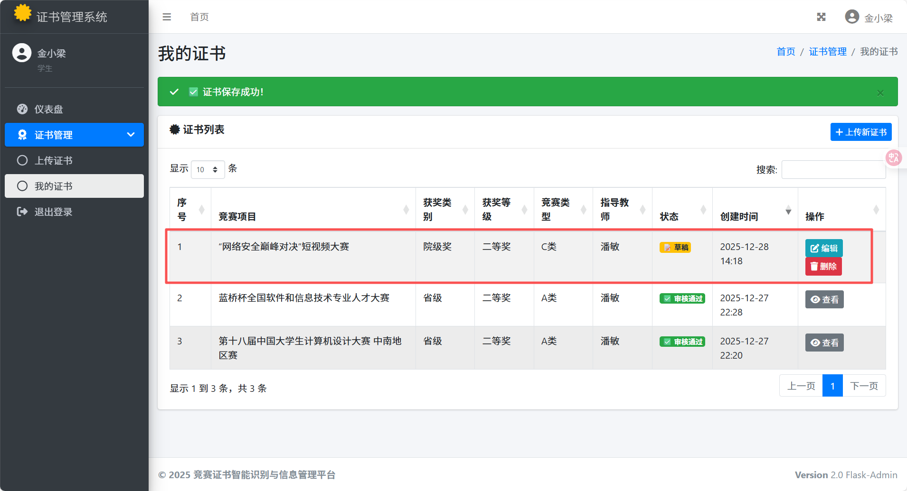

2.**提交审核**: 点击"提交审核"按钮，证书将提交给指导教师审核

**注意**: 

- 提交后的证书不能直接编辑，如需修改请联系指导教师或管理员
- 请确保在证书提交截止时间之前完成提交

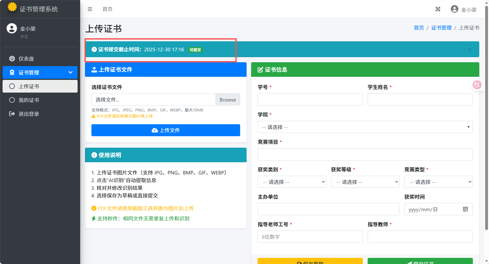

- 系统会在页面顶部显示证书提交截止时间提醒

### 2.4 查看我的证书

#### 2.4.1 进入证书列表

1. 在左侧菜单栏找到"证书管理"分类
2. 点击"我的证书"菜单项
3. 系统会显示您上传的所有证书列表

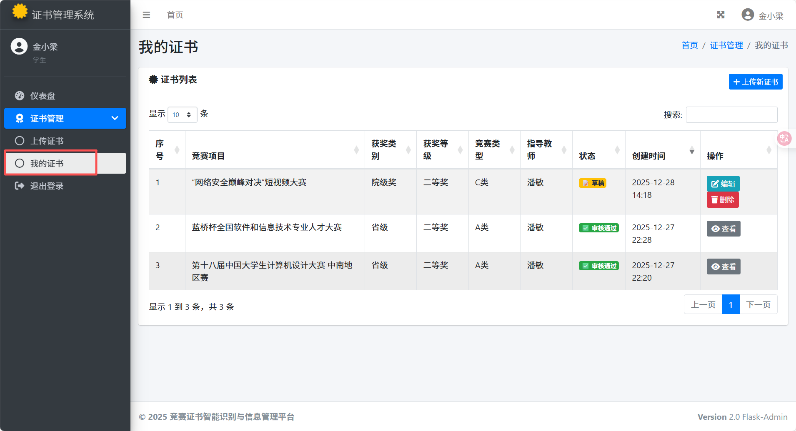

#### 2.4.2 证书列表说明

证书列表显示以下信息：

- **证书编号**: 系统自动生成的证书ID
- **学生姓名**: 获奖学生姓名
- **竞赛项目**: 竞赛名称
- **获奖类别**: 获奖类别
- **获奖等级**: 获奖等级
- **状态**: 证书当前状态（草稿/待教师审核/已通过等）
- **创建时间**: 证书创建时间
- **操作**: 可执行的操作（查看/编辑/删除）

#### 2.4.3 查看证书详情

1. 在证书列表中，点击"查看"按钮
2. 系统会显示证书的详细信息，包括：
   - 证书基本信息
   - 证书图片预览
   - 审核状态和审核记录

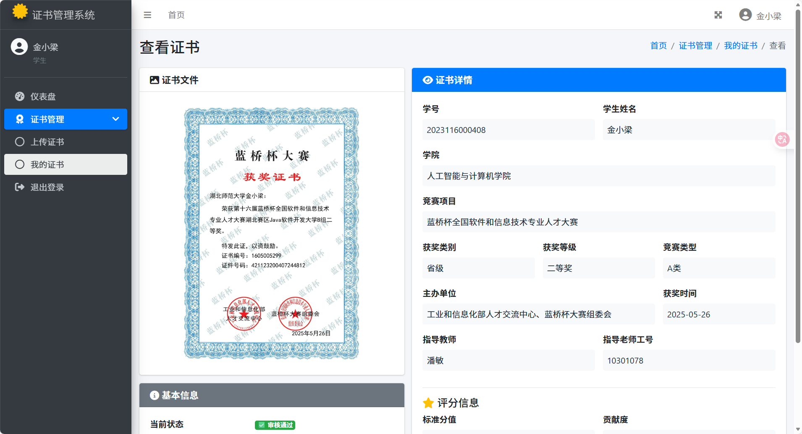

#### 2.4.4 编辑证书

1. 在证书列表中，找到状态为"草稿"的证书
2. 点击"编辑"按钮
3. 修改证书信息
4. 点击"保存"按钮保存修改

**注意**: 

- 只有草稿状态的证书可以编辑
- 已提交的证书不能直接编辑，如需修改请联系指导教师或管理员

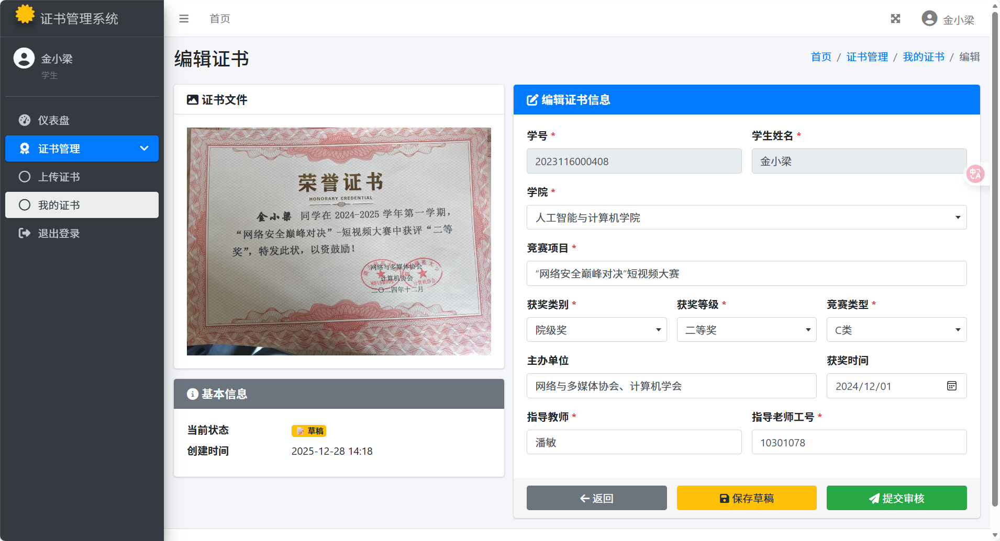

#### 2.4.5 删除证书

1. 在证书列表中，找到要删除的证书
2. 点击"删除"按钮
3. 确认删除操作

**注意**: 

- 只有草稿状态的证书可以删除
- 删除操作不可恢复，请谨慎操作

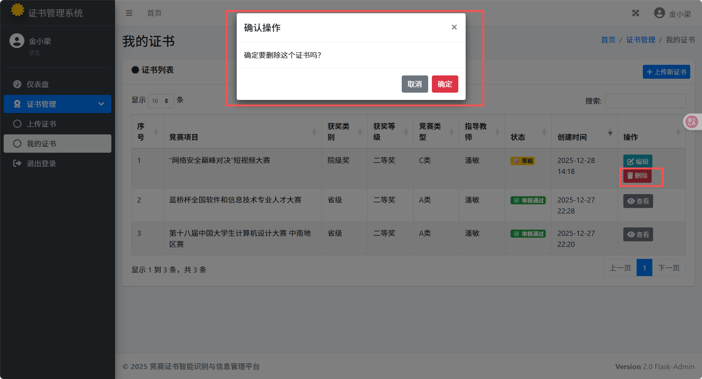

### 2.5 查看仪表盘

登录后，系统会自动显示仪表盘页面，展示以下统计信息：

- **我的证书总数**: 您上传的证书总数
- **已提交证书数**: 已提交审核的证书数量
- **草稿证书数**: 保存为草稿的证书数量

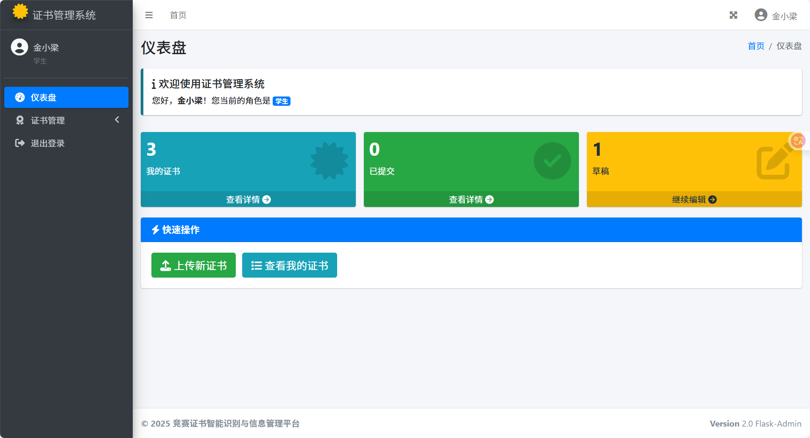

---

## 三、教师端操作指南

### 3.1 登录系统

1. 打开系统登录页面
2. 输入您的**工号**和**密码**
3. 点击"登录"按钮
4. 登录成功后，系统会自动跳转到仪表盘页面

**注意**: 教师账号由管理员创建或自主注册，如无账号请联系管理员。

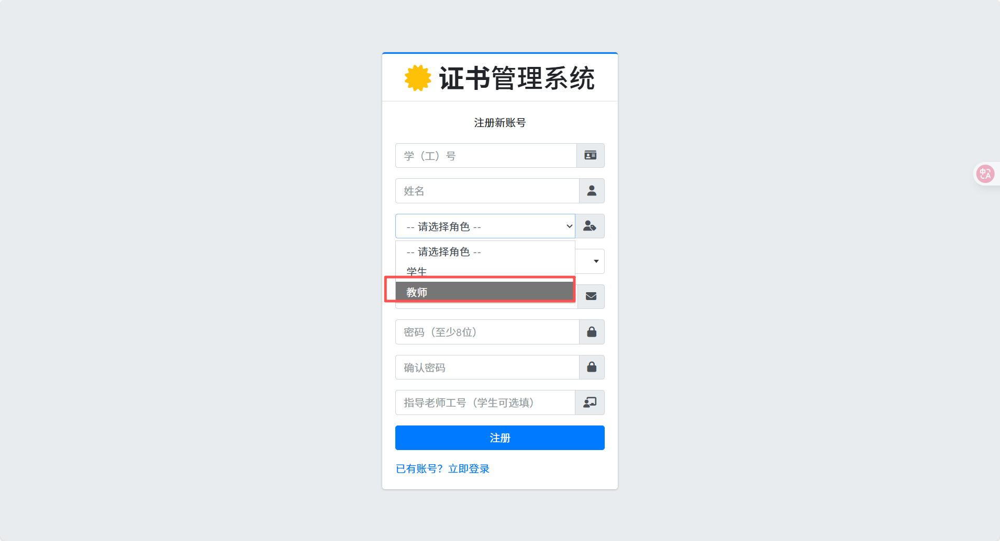

### 3.2 上传证书

教师可以上传证书，操作流程与学生端相同，请参考[2.3 上传证书](#23-上传证书)章节。

**注意**: 教师上传的证书，提交后会直接进入"待管理员审核"状态。

### 3.3 查看学生证书

#### 3.3.1 进入证书列表

1. 在左侧菜单栏找到"证书管理"分类
2. 点击"证书数据"菜单项
3. 系统会显示您指导的所有学生的证书列表

**注意**: 教师只能查看自己指导的学生（advisor_id匹配）的证书。

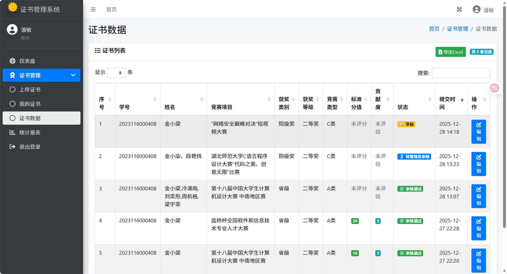

#### 3.3.2 证书列表功能

证书列表提供以下功能：

- **查看详情**: 点击"查看"按钮查看证书详细信息

- **编辑证书**: 点击"编辑"按钮编辑证书信息（仅限草稿和待教师审核状态）

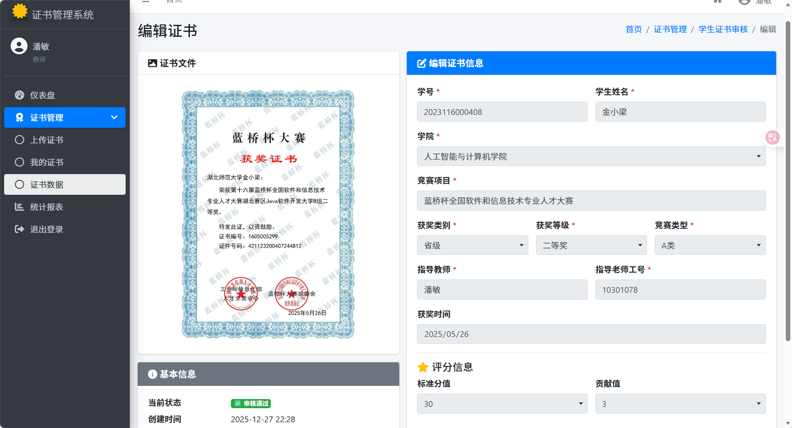

- **审核评分**: 点击"审核"按钮对证书进行评分和审核
- **导出数据**: 点击"导出Excel"按钮导出证书数据

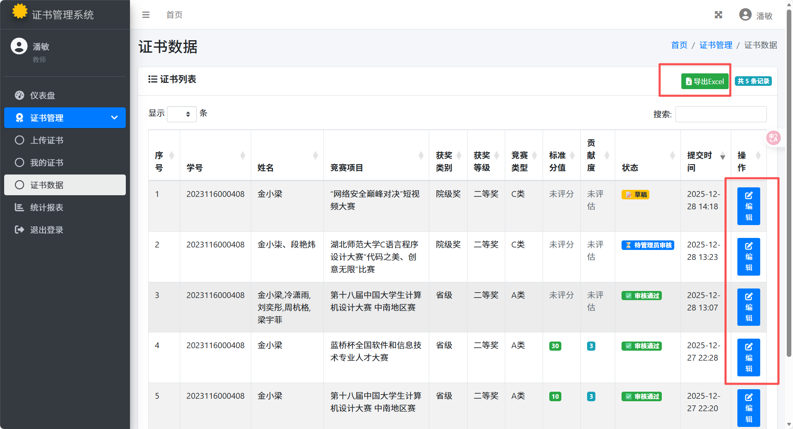

#### 3.3.3 筛选和搜索

在证书列表页面，您可以：

- 使用搜索框按学生姓名、学号、竞赛项目等关键词搜索

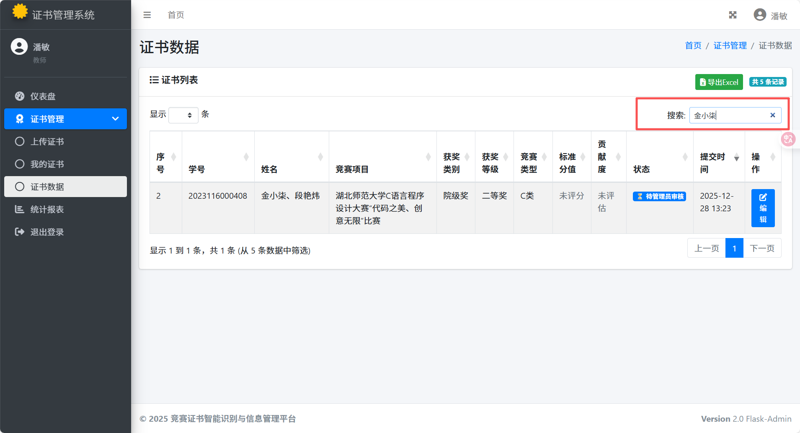

### 3.4 审核学生证书

#### 3.4.1 进入审核页面

1. 在证书列表中，找到状态为"待教师审核"的证书
2. 点击"审核"或"编辑"按钮
3. 进入证书审核/编辑页面
   
   
   
   

#### 3.4.2 审核证书信息

1. 查看证书的详细信息，确认信息是否正确
2. 如有错误，可以直接修改证书信息
3. 查看证书图片，确认证书真实性
   
   

#### 3.4.3 设置评分

在审核页面，您可以设置以下评分信息：

- **标准分**: 根据获奖类别和等级，选择对应的标准分
- **贡献值**: 根据竞赛类型和获奖等级，选择对应的贡献值

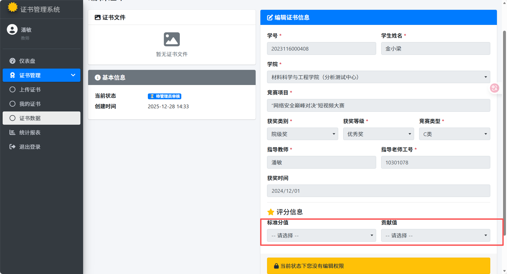

#### 3.4.4 提交审核

1. 确认证书信息无误后，点击"提交审核"按钮
2. 证书状态将变为"待管理员审核"
3. 系统会记录审核时间和审核人信息

**注意**: 

- 如果证书信息有误，您可以修改后重新提交
- 提交后，证书将进入管理员审核流程

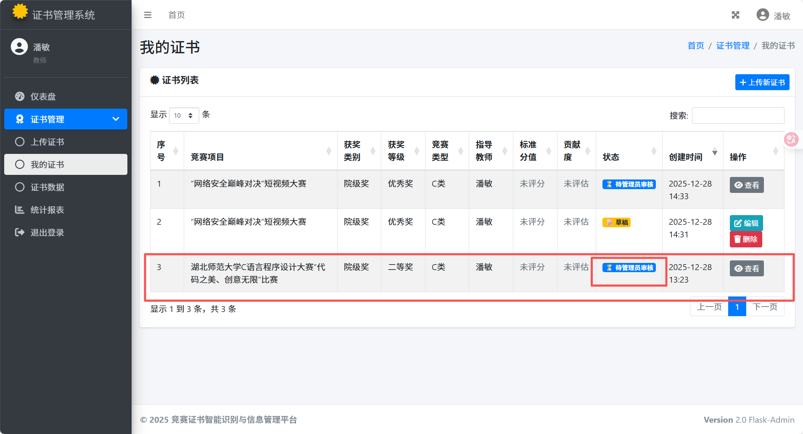

### 3.5 导出证书数据

1. 在"证书数据"页面，点击"导出Excel"按钮
2. 系统会自动生成Excel文件并下载
3. Excel文件包含以下信息：
   - 序号
   - 学号、姓名、学院
   - 竞赛项目、获奖类别、获奖等级、竞赛类型
   - 获奖时间
   - 指导教师信息
   - 标准分、贡献值
   - 证书状态
   - 创建时间

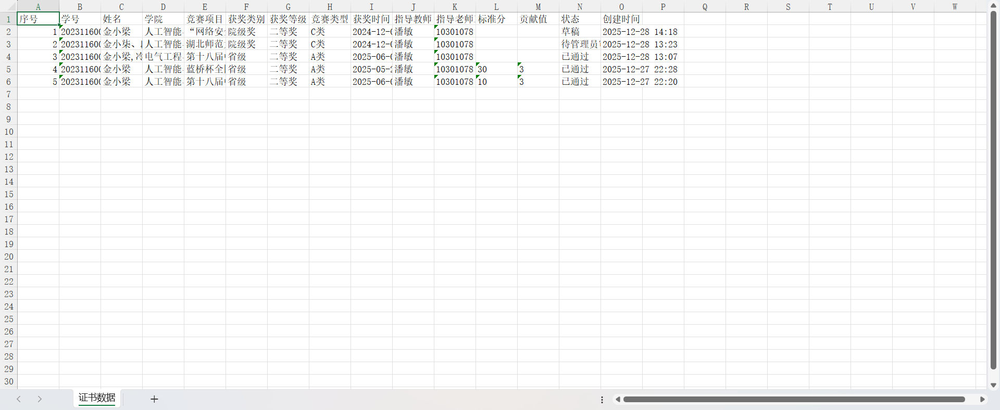

### 3.6 查看仪表盘

教师登录后，仪表盘会显示以下统计信息：

- **指导证书总数**: 您指导的学生证书总数
- **本院证书统计**: 按学院统计的证书数量

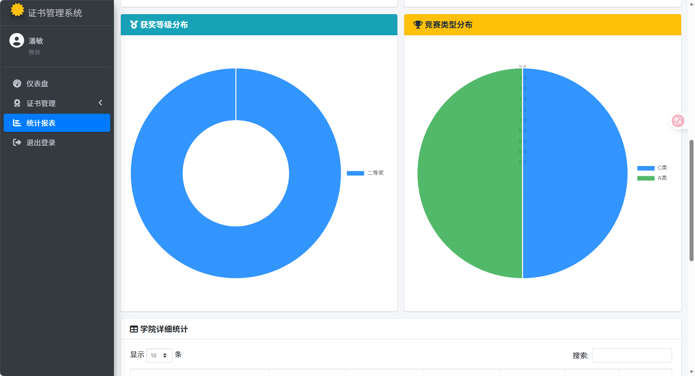

---

## 四、教学秘书端操作指南

### 4.1 登录系统

1. 打开系统登录页面
2. 输入您的**工号**和**密码**
3. 点击"登录"按钮
4. 登录成功后，系统会自动跳转到仪表盘页面

**注意**: 教学秘书账号由管理员创建。

### 4.2 查看证书数据

#### 4.2.1 进入证书列表

1. 在左侧菜单栏找到"证书管理"分类
2. 点击"证书数据"菜单项
3. 系统会显示本学院的所有证书列表

**注意**: 教学秘书只能查看本学院（department匹配）的证书数据。

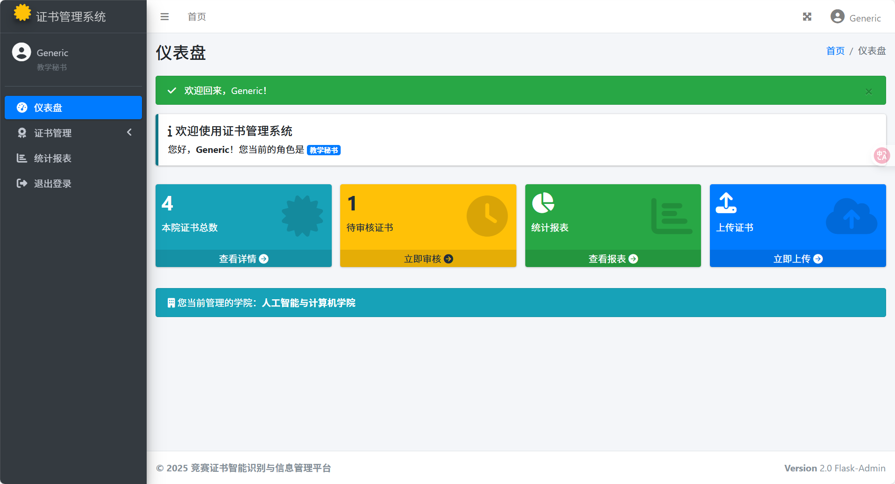

#### 4.2.2 证书管理功能

教学秘书可以对证书进行以下操作：

- **查看详情**: 查看证书的完整信息
- **编辑证书**: 编辑证书信息（所有状态都可以编辑）
- **审核证书**: 审核证书并设置评分
- **导出数据**: 导出证书数据为Excel文件

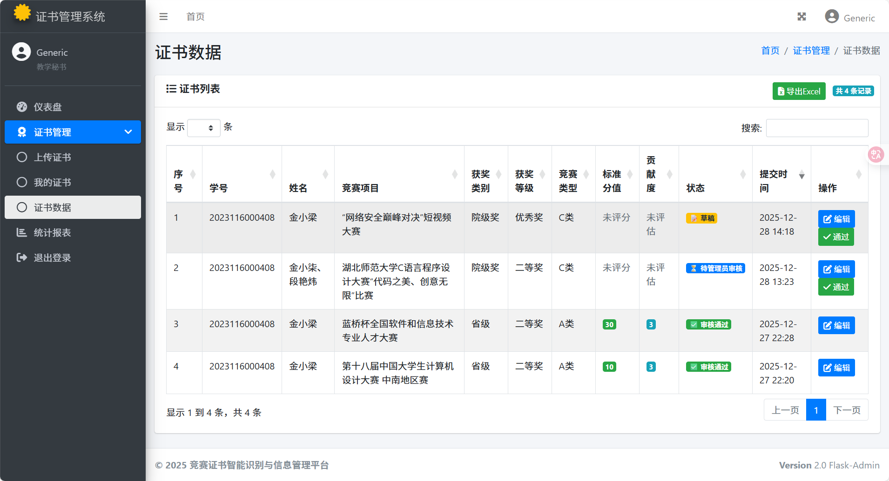

### 4.3 审核证书

教学秘书可以审核本学院的所有证书，审核流程与教师端相同，请参考[3.4 审核学生证书](#34-审核学生证书)章节。

**注意**: 教学秘书可以审核所有状态的证书，包括已提交和待审核的证书。

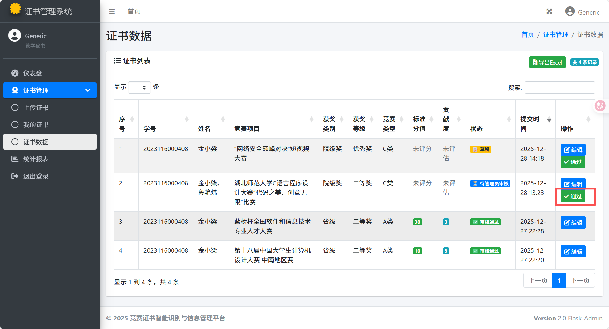

### 4.4 查看统计报表

#### 4.4.1 进入统计页面

1. 在左侧菜单栏找到"数据分析"分类
2. 点击"统计报表"菜单项
3. 系统会显示本学院的统计报表

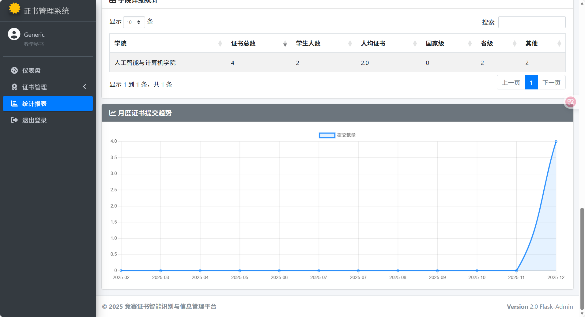

#### 4.4.2 统计报表内容

统计报表包含以下内容：

- **基础统计**: 
  
  - 证书总数
  - 已提交证书数
  - 学生总数
  - 教师总数

- **按学院统计**: 显示各学院的证书数量分布（仅显示本学院）

- **按获奖类别统计**: 显示各类别证书的数量分布

- **按获奖等级统计**: 显示各等级证书的数量分布

- **按竞赛类型统计**: 显示各类型竞赛证书的数量分布

- **时间趋势**: 显示证书提交的时间趋势图

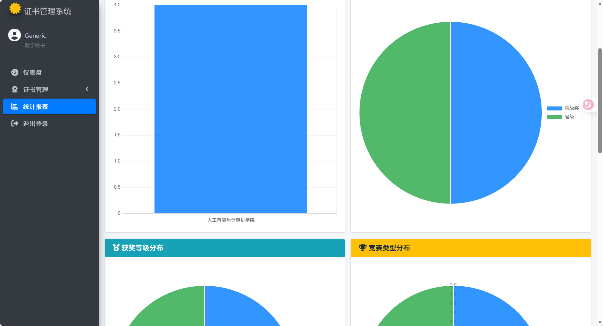

### 4.5 查看仪表盘

教学秘书登录后，仪表盘会显示以下统计信息：

- **本院证书总数**: 本学院的证书总数
- **待审核证书数**: 本学院待审核的证书数量
- **本院统计**: 按学院、类别、等级等维度的统计信息

---

## 五、管理端操作指南

### 5.1 登录系统

1. 打开系统登录页面
2. 输入管理员的**账号**和**密码**
3. 点击"登录"按钮
4. 登录成功后，系统会自动跳转到仪表盘页面

**注意**: 管理员拥有系统的全部权限。

### 5.2 用户管理

#### 5.2.1 查看用户列表

1. 在左侧菜单栏找到"用户管理"分类
2. 点击"用户列表"菜单项
3. 系统会显示所有用户列表

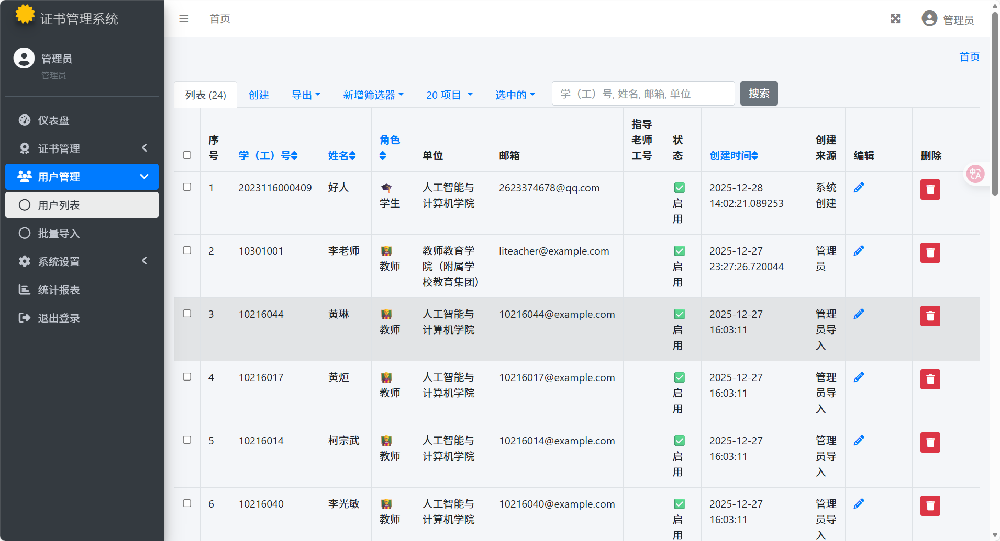

#### 5.2.2 添加用户

1. 在用户列表页面，点击"创建"按钮
2. 填写用户信息：
   - **工号/学号**: 用户的唯一标识
   - **姓名**: 用户真实姓名
   - **角色**: 选择用户角色（学生/教师/教学秘书/管理员）
   - **学院**: 选择用户所在学院
   - **邮箱**: 用户邮箱地址
   - **密码**: 设置初始密码
   - **是否启用**: 选择是否启用该账号
3. 点击"保存"按钮创建用户

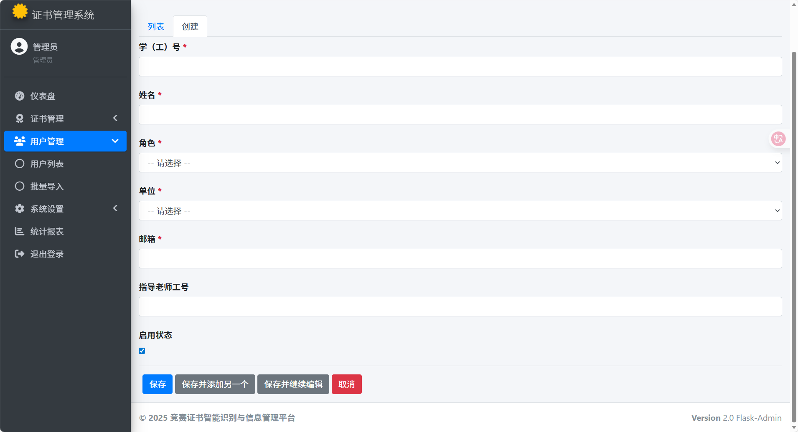

#### 5.2.3 编辑用户

1. 在用户列表中，找到要编辑的用户
2. 点击"编辑"按钮
3. 修改用户信息
4. 点击"保存"按钮保存修改

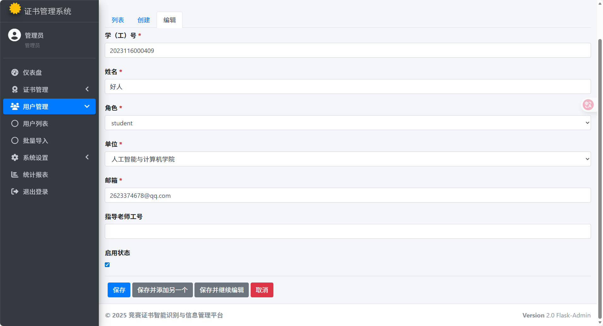

**注意**: 

- 可以修改用户的角色、学院、邮箱等信息
- 可以重置用户密码
- 可以启用或禁用用户账号

#### 5.2.4 删除用户

1. 在用户列表中，找到要删除的用户
2. 点击"删除"按钮
3. 确认删除操作

**注意**: 

- 删除用户前，请确保该用户没有关联的证书数据
- 删除操作不可恢复，请谨慎操作
  
  

#### 5.2.5 批量导入用户

1. 在左侧菜单栏找到"用户管理"分类
2. 点击"批量导入"菜单项
3. 下载导入模板（如果还没有）
4. 按照模板格式填写用户信息：
   - **工号/学号**: 必填，唯一标识
   - **姓名**: 必填
   - **学院**: 必填，从下拉列表中选择
   - **角色**: 必填，支持"学生"、"教师"、"教学秘书"、"管理员"或英文
   - **邮箱**: 必填，必须唯一
   - **密码**: 可选，如果不填则使用默认密码
5. 保存Excel文件
6. 在批量导入页面，点击"选择文件"按钮
7. 选择填写好的Excel文件
8. 点击"导入"按钮
9. 系统会显示导入结果，包括成功数量、跳过数量和错误信息

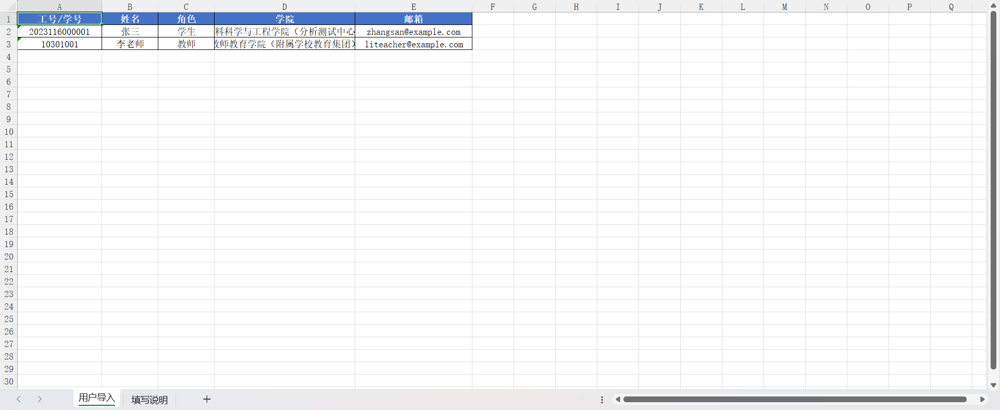

**注意**: 

- 如果用户已存在（根据工号/学号或邮箱判断），系统会跳过该用户
- 导入过程中如有错误，系统会显示具体的错误信息
- 建议先导入少量用户测试，确认无误后再批量导入

### 5.3 证书管理

#### 5.3.1 查看所有证书

1. 在左侧菜单栏找到"证书管理"分类
2. 点击"证书数据"菜单项
3. 系统会显示所有证书列表

**注意**: 管理员可以查看和编辑所有证书，不受学院限制。

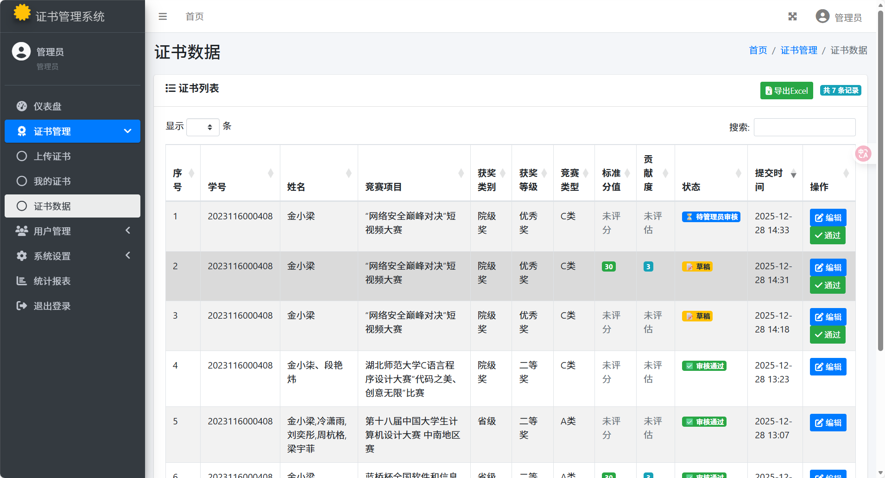

#### 5.3.2 证书管理功能

管理员可以对证书进行以下操作：

- **查看详情**: 查看证书的完整信息
- **编辑证书**: 编辑任何状态的证书信息
- **删除证书**: 删除证书记录
- **审核证书**: 审核证书并设置评分
- **导出数据**: 导出所有证书数据

#### 5.3.3 证书状态管理

管理员可以修改证书的状态：

- 将草稿状态的证书直接设置为"已通过"
- 修改证书的评分信息

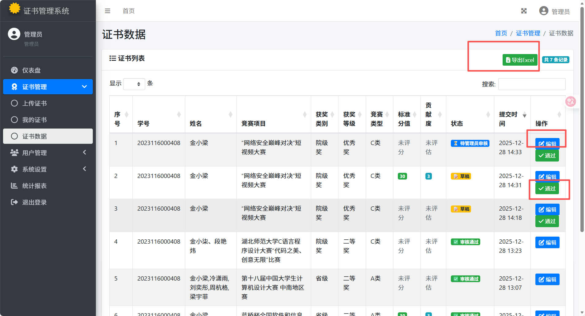

### 5.4 字典管理

#### 5.4.1 进入字典管理

1. 在左侧菜单栏找到"系统设置"分类
2. 点击"字典管理"菜单项
3. 系统会显示所有字典类型列表

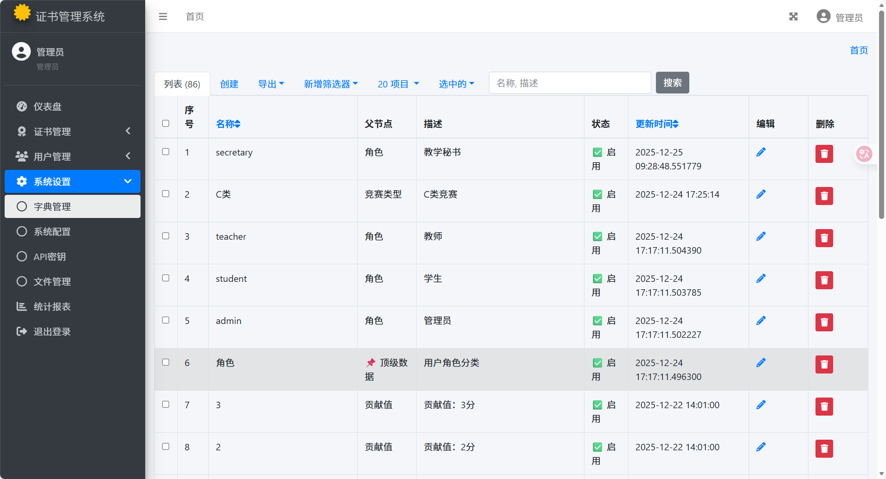

#### 5.4.2 字典类型说明

系统包含以下字典类型：

- **学院**: 学校各学院名称
- **获奖类别**: 如国家级、省级、市级等
- **获奖等级**: 如一等奖、二等奖、三等奖等
- **竞赛类型**: 如A类、B类等
- **标准分**: 证书对应的标准分选项
- **贡献值**: 证书对应的贡献值选项

#### 5.4.3 添加字典项

1. 在字典管理页面，找到要添加项的字典类型
2. 点击"创建"按钮
3. 填写字典项信息：
   - **字典类型**: 选择字典类型
   - **字典值**: 填写字典值（如"计算机学院"）
   - **排序**: 设置显示顺序（可选）
4. 点击"保存"按钮

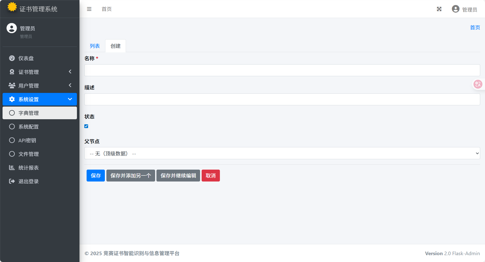

#### 5.4.4 编辑字典项

1. 在字典列表中，找到要编辑的字典项
2. 点击"编辑"按钮
3. 修改字典项信息
4. 点击"保存"按钮

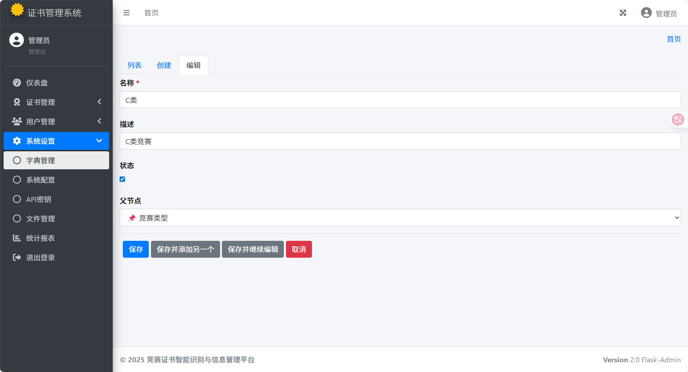

#### 5.4.5 删除字典项

1. 在字典列表中，找到要删除的字典项
2. 点击"删除"按钮
3. 确认删除操作

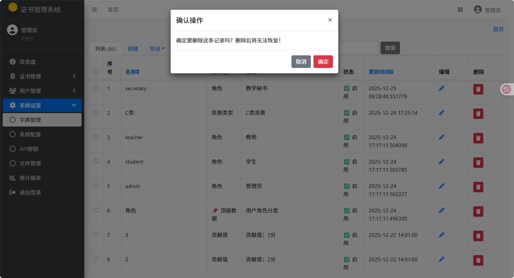

**注意**: 

- 删除字典项前，请确保没有证书使用该字典值
- 删除操作可能影响已存在的证书数据，请谨慎操作

### 5.5 系统配置

#### 5.5.1 进入系统配置

1. 在左侧菜单栏找到"系统设置"分类
2. 点击"系统配置"菜单项
3. 系统会显示系统配置列表

#### 5.5.2 配置证书提交截止时间

1. 在系统配置列表中，找到"证书提交截止时间"配置项
2. 点击"编辑"按钮
3. 设置截止日期和时间
4. 点击"保存"按钮

**注意**: 

- 设置截止时间后，学生和教师在截止时间之后将无法提交或修改证书
- 管理员和教学秘书不受截止时间限制

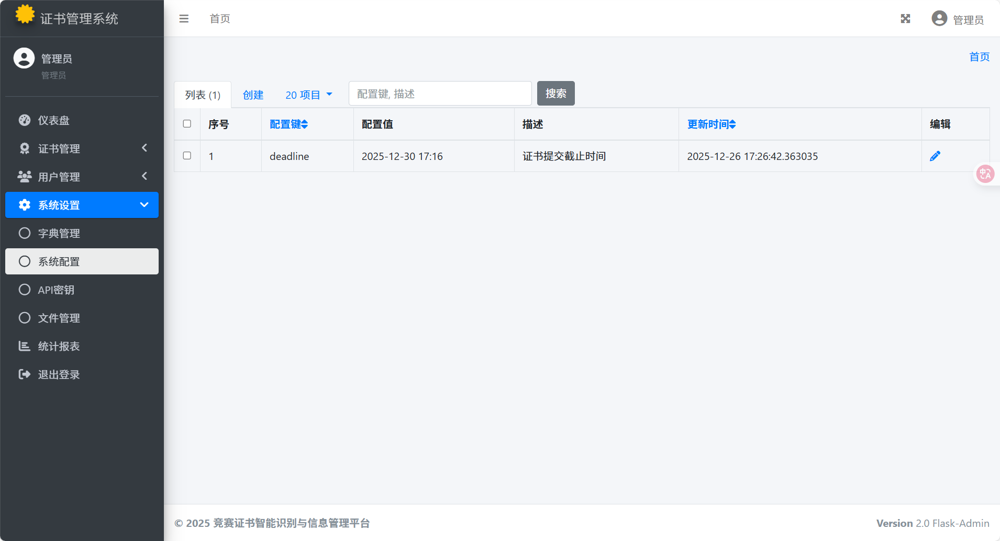

### 5.6 API密钥管理

#### 5.6.1 进入API密钥管理

1. 在左侧菜单栏找到"系统设置"分类
2. 点击"API密钥"菜单项
3. 系统会显示API密钥列表

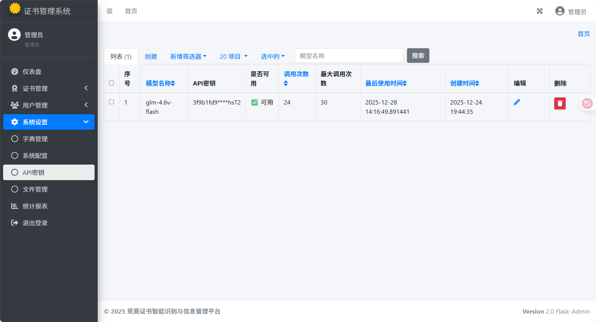

#### 5.6.2 添加API密钥

1. 在API密钥列表页面，点击"创建"按钮
2. 填写API密钥信息：
   - **密钥名称**: 给密钥起一个名称（如"智谱AI"）
   - **API类型**: 选择API类型（如"glm4v"）
   - **API密钥**: 填写实际的API密钥
   - **是否启用**: 选择是否启用该密钥
3. 点击"保存"按钮

**注意**: 

- API密钥用于AI证书识别功能
- 请妥善保管API密钥，不要泄露
- 建议定期更换API密钥

#### 5.6.3 编辑和删除API密钥

1. 在API密钥列表中，找到要编辑或删除的密钥
2. 点击"编辑"或"删除"按钮
3. 执行相应操作

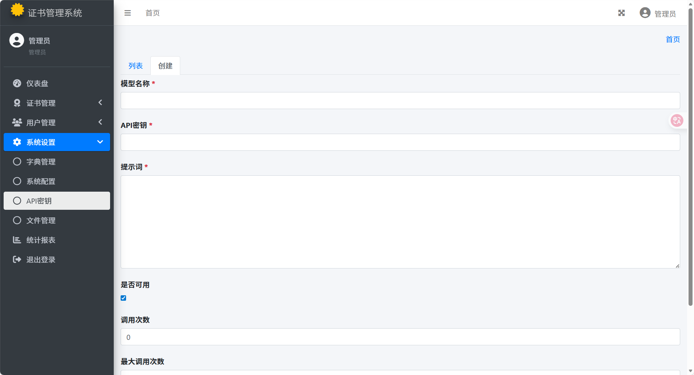

### 5.7 文件管理

#### 5.7.1 进入文件管理

1. 在左侧菜单栏找到"系统设置"分类
2. 点击"文件管理"菜单项
3. 系统会显示所有上传的文件列表

#### 5.7.2 文件管理功能

文件管理页面显示以下信息：

- **文件名**: 上传的文件名
- **文件类型**: 文件类型（图片/PDF等）
- **文件大小**: 文件大小
- **上传用户**: 上传文件的用户
- **上传时间**: 文件上传时间
- **MD5值**: 文件的MD5哈希值

管理员可以：

- **查看文件**: 点击文件名查看文件
- **删除文件**: 删除不需要的文件
- **搜索文件**: 按文件名、用户等搜索文件

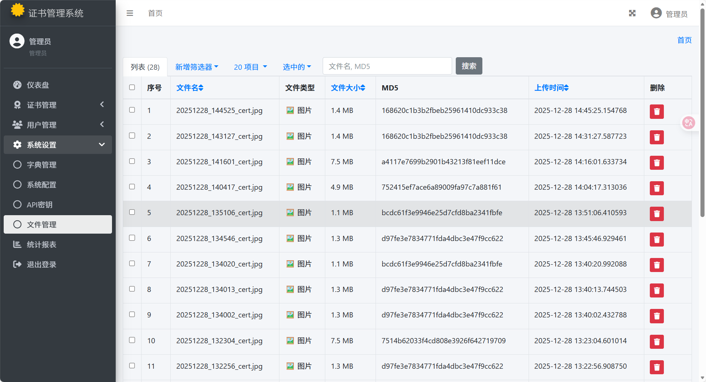

### 5.8 统计报表

#### 5.8.1 进入统计页面

1. 在左侧菜单栏找到"数据分析"分类
2. 点击"统计报表"菜单项
3. 系统会显示全局统计报表

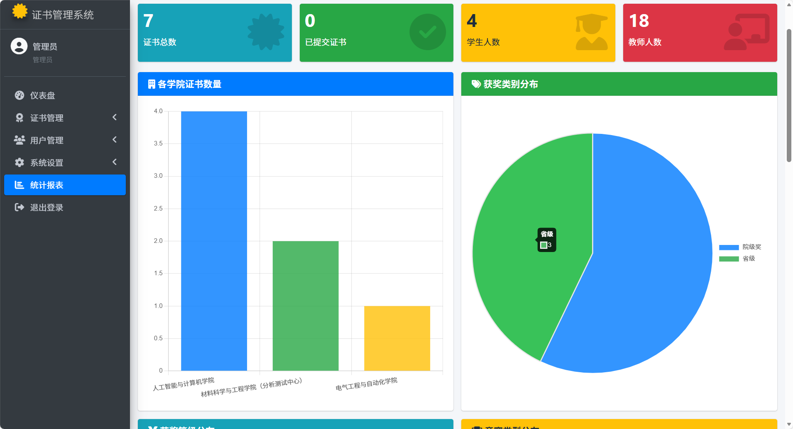

#### 5.8.2 统计报表内容

管理员可以查看以下统计信息：

- **全局统计**: 
  
  - 用户总数（按角色分类）
  - 证书总数
  - 待审核证书数
  - 草稿证书数

- **按学院统计**: 显示各学院的证书数量分布

- **按获奖类别统计**: 显示各类别证书的数量分布

- **按获奖等级统计**: 显示各等级证书的数量分布

- **按竞赛类型统计**: 显示各类型竞赛证书的数量分布

- **时间趋势**: 显示证书提交的时间趋势图

### 5.9 查看仪表盘

管理员登录后，仪表盘会显示以下统计信息：

- **全局统计**: 用户总数、证书总数、待审核证书数等
- **按学院统计**: 各学院的证书分布
- **按类别统计**: 各类别证书的分布
- **按等级统计**: 各等级证书的分布
- **按类型统计**: 各类型竞赛证书的分布

---

## 六、常见问题

### 6.1 登录问题

**Q: 忘记密码怎么办？**

A: 请联系管理员重置密码。目前系统暂不支持自助找回密码功能。

**Q: 登录时提示"账号或密码错误"？**

A: 请检查：

1. 账号和密码是否正确（注意大小写）
2. 账号是否已被禁用
3. 如仍无法登录，请联系管理员

### 6.2 证书上传问题

**Q: 上传文件时提示"不支持该文件格式"？**

A: 系统只支持图片格式（JPG、PNG、BMP、GIF、WEBP）。如果您的证书是PDF格式，请先转换为图片再上传。

**Q: AI识别失败怎么办？**

A: 如果AI识别失败或识别结果不准确，您可以：

1. 检查API密钥配置是否正确
2. 手动填写证书信息
3. 联系管理员检查AI服务配置

**Q: 上传的文件大小有限制吗？**

A: 建议文件大小不超过10MB。如果文件过大，请先压缩图片。

### 6.3 证书编辑问题

**Q: 为什么不能编辑已提交的证书？**

A: 为了保持数据完整性，已提交的证书不能直接编辑。如需修改，请联系指导教师或管理员或者教学秘书。

**Q: 证书提交后还能修改吗？**

A: 学生提交的证书，在教师审核前可以联系教师修改。教学秘书或管理员可以修改任何状态的证书。

B:学生只能修改草稿状态下的证书数据，教师可以修改草稿和待教师审核状态下的证书数据，教学秘书或管理员可以修改任何状态的证书。

### 6.4 审核问题

**Q: 如何知道证书的审核状态？**

A: 在"我的证书"页面，可以查看每个证书的状态。状态包括：草稿、待教师审核、待管理员审核、已通过。

**Q: 证书审核需要多长时间？**

A: 审核时间取决于教师和管理员的工作效率。一般情况下，教师审核在1-3个工作日内完成，管理员审核在3-5个工作日内完成。

### 6.5 数据导出问题

**Q: 导出的Excel文件打不开？**

A: 请确保您的Excel版本支持.xlsx格式。建议使用Microsoft Excel 2010或更高版本，或使用WPS Office打开。

**Q: 导出的数据不完整？**

A: 请检查筛选条件，确保选择了正确的数据范围。如有问题，请联系管理员。

### 6.6 其他问题

**Q: 系统提示"已超过证书提交截止时间"？**

A: 系统设置了证书提交截止时间，超过该时间后，学生和教师将无法提交或修改证书。如需提交，请联系管理员或教学秘书。

**Q: 如何联系管理员？**

A: 请联系系统管理员或技术支持人员。您也可以在系统中查看管理员联系方式。

---

## 附录

### A. 浏览器兼容性

系统支持以下浏览器：

- Chrome（推荐）
- Firefox
- Edge
- Safari

建议使用最新版本的浏览器以获得最佳体验。

### B. 系统要求

- 操作系统: Windows、macOS、Linux
- 浏览器: 现代浏览器（支持HTML5）
- 网络: 稳定的网络连接

### C. 技术支持

如遇到技术问题，请联系系统管理员或技术支持团队。

---

**文档版本**: v1.0  
**最后更新**: 2025年12月  
